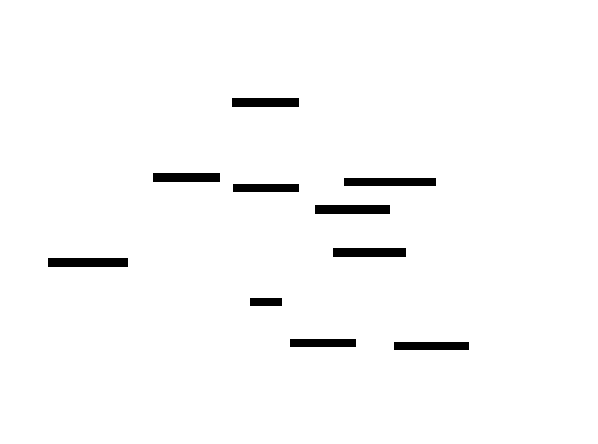

# Architecture

<!-- Design-target architecture document for SIA (Self-Improving AI).
     Produced in baseline-audit mode by systems-architect: describes what EXISTS on disk
     as of the last-verified date. Every component-table row and SVG reference is code-verified.
     For code-verified developer navigation, see docs/architecture.md.
     Maintained by pipeline agents via section ownership. -->

## 1. System Overview

| Attribute | Value |
|-----------|-------|
| **System** | SIA — Self-Improving AI framework (`sia-agent`) |
| **Type** | CLI tool / research framework (PyPI library) |
| **Language / Framework** | Python 3.11+ (setuptools build) |
| **Architecture pattern** | Single-process orchestrator driving subprocess-isolated agents (no service tier) |
| **Source stage** | Baseline audit — pipeline `arch-baseline` |
| **Last verified** | 2026-06-05 by systems-architect (against commit `1a6776d`) |

SIA implements a *self-improving agent loop*. A **Meta-Agent** reads a task specification and
generates a task-specific **Target Agent** (`target_agent.py`). The Target Agent runs the task in
an isolated subprocess and records an execution trajectory. A **Feedback/Improvement Agent** then
analyzes that trajectory and rewrites the Target Agent for the next *generation*. This repeats for
`--max_gen` generations; a Context Manager records the evolution (code growth, metrics, LLM-authored
diff summaries) into a per-run `context.md`.

The meta- and feedback-agents are driven by a pluggable **agent backend** — `claude`
(`claude-agent-sdk`, invoked in-process) or `openhands` (`openhands-ai`). The Target Agent itself
is plain generated Python executed as a separate OS subprocess, optionally inside a network-isolated
Docker container. SIA is distributed as a wheel that bundles four reference tasks (gpqa, lawbench,
longcot-chess, spaceship-titanic) as package data.

The **core architectural invariant** is a one-way internal dependency spine: `orchestrator` depends
on `config`, `context_manager`, and `util`; `context_manager` depends on `config` and (lazily) on
`util`; `util` and `config` depend on nothing internal. There are no import cycles. See ADR
`dec-draft` referenced in §8.

## 2. System Context

<!-- L0 diagram: system boundary + external actors/dependencies. SIA as a single box.
     Edit docs/diagrams/architecture/src/architecture.c4, then regenerate:
       likec4 gen d2 docs/diagrams/architecture/src/ -o docs/diagrams/architecture/rendered/
       d2 docs/diagrams/architecture/rendered/context.d2 docs/diagrams/architecture/rendered/context.svg -->


<details>
<summary>LikeC4 source (edit docs/diagrams/architecture/src/architecture.c4 to update this diagram)</summary>

```c4
// System Context view — L0. See docs/diagrams/architecture/src/architecture.c4 for the full model.
view context of sia {
  title "SIA — System Context (L0)"
  include user, sia, llm, docker
}
```

</details>

**External actors and dependencies (code-verified):**

| Element | Role | Evidence |
|---------|------|----------|
| Researcher (person) | Invokes `sia --task … --max_gen N` | `sia/orchestrator.py:main` argparse, `[project.scripts] sia = "sia.orchestrator:main"` |
| Agent Backend LLM (external) | Drives meta & feedback agents; Claude via `claude_agent_sdk.query`, OpenHands via `openhands.sdk` | `sia/util.py:run_agent_claude`, `run_agent_openhands` |
| Docker (external, optional) | Network-isolated container for target-agent execution under `--sandbox docker` | `sia/orchestrator.py:_run_target_agent_sandboxed` |

> **Component detail:** [Components](#3-components)

## 3. Components

<!-- L1 diagram: the five internal components and their one-way dependencies.
     Edit docs/diagrams/architecture/src/architecture.c4, then regenerate (see §2 commands). -->



<details>
<summary>LikeC4 source (edit docs/diagrams/architecture/src/architecture.c4 to update this diagram)</summary>

```c4
// Components view — L1. See docs/diagrams/architecture/src/architecture.c4 for the full model.
view components of sia {
  title "SIA — Components (L1)"
  include *
}
```

</details>

<!-- aac:generated source=docs/diagrams/architecture/src/architecture.c4 view=components last-regen=2026-06-05 -->

| Component | Responsibility | Status | Key Files |
|-----------|---------------|--------|-----------|
| Orchestrator | CLI entry; resolves task; sets up run dir + per-run venv; assembles meta/feedback prompts; runs the generation loop; runs target agent + evaluation as subprocesses | Built | `sia/orchestrator.py`, `sia/__main__.py` |
| Context Manager | Maintains `runs/run_N/context.md`; extracts metrics (results.json / stdout regex); computes code-growth deltas; calls the backend LLM for per-generation diff summaries | Built | `sia/context_manager.py` |
| Agent Runner | Backend dispatch for meta/feedback agents — `claude` (in-process `claude_agent_sdk.query`) or `openhands`; lazy-imports each SDK | Built | `sia/util.py` |
| Config | Single source of truth for defaults; `from_env()` applies `SIA_*` env-var overrides; defines venv package set, timeouts, truncation/size limits, Docker settings | Built | `sia/config.py` |
| Bundled Tasks | Package-data templates: `task.md`, `reference_target_agent.py`, `SAMPLE_TASK_DESCRIPTIONS.md`, `evaluate.py` per task, plus `_shared/` cross-task samples — read as TEXT by the orchestrator, never imported | Built | `sia/tasks/` (gpqa, lawbench, longcot-chess, spaceship-titanic, `_shared/`) |
| MLE-Bench dataset prep | Standalone utility script to build a task directory from an MLE-Bench competition (mlebench + Gemini) — not part of the loop; not wired to a console entry point | Built | `sia/prepare_mlebench_dataset.py` |

<!-- aac:end -->

**Component notes (code-verified):**

- The generated `target_agent.py` is **not** a SIA component — it is the *artifact* the loop produces
  and runs. It executes in a separate subprocess (per-run venv `python`, or Docker) and is never
  imported by SIA source.
- Bundled task reference agents (`sia/tasks/*/reference/reference_target_agent.py`) are excluded from
  both `ruff` and `ty` (`extend-exclude`/`exclude = ["sia/tasks/"]`) precisely because they ship as
  template *text*, not importable source.

## 4. Interfaces

<!-- Code-verified contracts between components and to externals. -->

| Interface | Type | Provider | Consumer(s) | Contract |
|-----------|------|----------|-------------|----------|
| `sia` CLI | Process args | Orchestrator | Researcher | `--max_gen`, `--run_id`, `--task`/`--task_dir` (mutually exclusive, required), `--meta_model`, `--task_model`, `--backend {claude,openhands}`, `--sandbox {none,docker}` (`sia/orchestrator.py:main`) |
| `run_agent(model_name, max_turns, prompt, agent_working_directory, backend)` | Async function | Agent Runner | Orchestrator, Context Manager | Dispatches to backend; raises `ValueError` on unknown backend (`sia/util.py`) |
| `Config.from_env()` | Classmethod | Config | Orchestrator | Returns a `Config` with `SIA_*` overrides applied; bad values silently fall back to defaults (`sia/config.py`) |
| `ContextManager.{initialize,add_generation,finalize}` | Methods | Context Manager | Orchestrator | Generation lifecycle; `add_generation` consumes a `gen_data` dict (success, timestamp, duration, agent_path, gen_dir, improvement_path, execution_type) |
| Target-agent CLI contract | Process args | Generated target agent | Orchestrator (runs it) | Must accept `--dataset_dir` (RO) and `--working_dir` (RW); must write `agent_execution.json` OR `agent_execution/execution_q*.json`. Enforced only by prompt text in `build_meta_prompt`, not by code. |
| `evaluate.py --gen-dir <dir>` | Process args | Bundled task | Orchestrator | Optional; expected to emit `results.json` in the gen dir (`sia/orchestrator.py:run_evaluation`) |

## 5. Data Flow

### Primary scenario — the generation loop


<details>
<summary>Mermaid source (edit docs/diagrams/generation-loop/src/generation-loop.mmd to update this diagram)</summary>

Sequence source lives at `docs/diagrams/generation-loop/src/generation-loop.mmd`; regenerate with
`mmdc -i docs/diagrams/generation-loop/src/generation-loop.mmd -o docs/diagrams/generation-loop/rendered/generation-loop.svg`.

</details>

**Run artifact layout (code-verified, written under the invocation CWD):**

```
runs/run_{run_id}/
  venv/                          # per-run virtualenv (uv if available, else stdlib venv)
  context.md                     # written by Context Manager
  gen_1/
    meta_agent_prompt.txt        # saved for transparency
    target_agent.py              # written by the meta-agent (LLM)
    target_agent_stdout.log
    agent_execution.json   OR  agent_execution/execution_q*.json
    results.json                 # if evaluate.py ran
    evaluation.log
  gen_2/ .. gen_N/
    feedback_agent_prompt.txt
    improvement.md               # written by the feedback-agent (gen >= 2)
    target_agent.py              # rewritten by the feedback-agent
    ...
```

**Key flow facts:**

1. The orchestrator refuses to start if `runs/run_{run_id}/` already exists (`setup_run_directory` → `sys.exit(1)`).
2. Target-agent execution failure is **non-fatal**: the loop logs the failure and still runs the
   feedback agent, passing a FAILED execution status (`_run_target_agent` returns `(False, …)`).
3. Execution-log loading auto-detects single-file vs. multi-trajectory format and enforces size caps
   (`MAX_EXECUTION_LOG_SIZE`) before parsing (`load_agent_execution`).
4. Metric extraction is layered: `results.json` → `detailed_results.json` → stdout regex
   (`ContextManager._extract_metrics`), first non-empty source wins.

## 6. Quality Attributes (current state)

### Testing

- **Framework:** pytest (`[project.optional-dependencies] dev`). 10 test modules, ~862 lines in `tests/`.
- **Coverage shape (verified by file names + spot reads):** config (`test_config.py`), context manager
  (`test_context_manager.py`), generation loop with mocked agents (`test_generation_loop.py`), CLI
  interface (`test_cli_interface.py`), orchestrator helpers (`test_orchestrator_helpers.py`),
  evaluation runner (`test_run_evaluation.py`), Docker sandbox command construction (`test_sandbox.py`),
  file-size limits (`test_size_limits.py`), bundled task structure (`test_task_structure.py`).
- **Mocking boundary:** the agent backends/LLMs are mocked (`unittest.mock.patch`); tests use `tmp_path`.
  No test makes a real LLM call.
- **No `.ai-state/TEST_TOPOLOGY.md`** exists; the project is below the topology-adoption thresholds
  (single package, one fast suite). Topology adoption is not recommended at this size.

### Observability

- **Logging:** stdlib `logging` configured at module import in `orchestrator.py` and `util.py`
  (INFO level, timestamped). The agent loop logs per-turn agent text, tool calls, and truncated tool
  results. No structured logging, metrics emitter, or tracing — appropriate for a CLI research tool.
- **Run transparency:** every prompt sent to an agent is persisted (`meta_agent_prompt.txt`,
  `feedback_agent_prompt.txt`); every generation's stdout is captured to a log file.

### Deployment

- **Distribution:** PyPI wheel `sia-agent` (setuptools). Console entry point `sia`. Tasks ship as
  package data (`[tool.setuptools.package-data]`).
- **No deployable service** — there is no server, container image, or infrastructure SIA itself runs
  as a daemon. `SYSTEM_DEPLOYMENT.md` is therefore intentionally absent (Phase 4 skip: no deployable
  components). Docker is a *runtime sandbox for the target agent*, not a deployment target for SIA.
- **Runtime prerequisites:** an agent-backend extra (`claude` / `openhands`), backend API credentials
  via environment (`ANTHROPIC_API_KEY`, `GOOGLE_API_KEY`/`GEMINI_API_KEY`, `OPENAI_API_KEY`, or
  `LLM_API_KEY`), and — for `--sandbox docker` — a working Docker daemon and the `python:3.11-slim`
  image. `uv` is used for venv creation when present, else stdlib `venv`.

## 7. Dependencies

| Dependency | Version (pyproject) | Purpose | Criticality |
|-----------|---------------------|---------|-------------|
| python-dotenv | `>=1.0` | Loads `.env` for API keys | High |
| numpy | `>=2.0` | Used by bundled tasks / venv package set | Medium |
| pandas | `>=2.0` | Tabular task data handling | Medium |
| scikit-learn | `>=1.4` | ML task evaluation helpers | Medium |
| claude-agent-sdk | `>=0.1.50` (extra `claude`) | Claude backend for meta/feedback agents | Critical (when backend=claude) |
| openhands-ai | `>=1.6.0` (extra `openhands`) | OpenHands backend | Critical (when backend=openhands) |
| google-generativeai | `>=0.8` (extra `mlebench`) | Gemini for `prepare_mlebench_dataset.py` | Low (utility only) |
| pytest, ruff | dev extra | Test + lint | Dev-only |

> The per-run venv installs its OWN package set (`Config.VENV_PACKAGES`: anthropic, openai,
> python-dotenv, google-genai, tqdm, pydantic, scikit-learn, pandas, numpy) — these are the libraries
> the *generated target agent* may use, distinct from SIA's own install dependencies.

## 8. Constraints

| Constraint | Type | Rationale |
|-----------|------|-----------|
| Python 3.11+ | Compatibility | `requires-python = ">=3.11"`; `tool.ty.environment` pins 3.11 |
| One-way internal import spine (no cycles) | Architectural | `orchestrator → {config, context_manager, util}`; `context_manager → config` + lazy `util`; verified by import reads. `context_manager` imports `util.run_agent` *inside a method* to avoid a circular import. |
| `runs/run_{run_id}/` must not pre-exist | Technical | Hard stop in `setup_run_directory` to prevent clobbering prior runs |
| Target agent paths injected via prompt, not enforced in code | Technical/Security | The RO-dataset / RW-working contract is communicated to the LLM in `build_meta_prompt`; only `--sandbox docker` enforces isolation at the OS level (network none, dataset RO mount) |
| Bundled task agents are template text, not source | Technical | Excluded from ruff + ty (`extend-exclude`/`exclude = ["sia/tasks/"]`) |
| LLM diff summary skipped for generation 1 | Behavioral | No prior generation to diff against (`_generate_llm_summary` early-returns) |

## 9. Decisions

<!-- aac:authored owner=systems-architect last-reviewed=2026-06-05 -->

Architectural decisions are recorded as ADRs in [`.ai-state/decisions/`](decisions/). The canonical,
auto-generated cross-reference is [`DECISIONS_INDEX.md`](decisions/DECISIONS_INDEX.md). In-flight
pipeline ADRs live as fragments under [`decisions/drafts/`](decisions/drafts/) and are promoted to
stable `dec-NNN` at merge-to-main.

This baseline pass recorded one decision: the **target-agent process-isolation boundary** (the loop
generates and runs target agents as OS subprocesses, optionally Docker-sandboxed, never importing
them) — see the draft ADR in `decisions/drafts/`.

<!-- aac:end -->

## 10. Open Questions / Known Gaps

These are surfaced per the behavioral contract (Surface Assumptions); none block the baseline.

1. **[assumption: systems-architect]** I treat `prepare_mlebench_dataset.py` as an out-of-loop
   developer utility (it has no console entry point and is imported by nothing). If it is meant to be
   a first-class user-facing command, it lacks a `[project.scripts]` entry — flagged, not fixed.
2. **[gap]** The RO-dataset / RW-working-dir contract for the target agent is enforced **only** in
   `--sandbox docker` mode. Under the default `--sandbox none`, a generated target agent can read/write
   anywhere the venv python can. This is a deliberate trade-off (sandbox is opt-in) but is a real
   security boundary gap worth noting for any non-trusted task source.
3. **[gap]** `openhands` and `mlebench` extras pin SDK/model identifiers
   (`gemini/gemini-3.1-pro-preview`, `openhands-ai>=1.6.0`) that I did not verify for current
   availability against upstream — version/capability drift is possible but out of scope for a
   read-only baseline.
4. **[assumption: systems-architect]** `orchestrator.py` is 1152 lines — above the 800-line ceiling
   in the coding-style rule. I record this as an observed fact, not a refactor directive (baseline-audit
   mode produces no `SYSTEMS_PLAN.md`). The file is cohesively the loop + prompt builders + subprocess
   helpers; a future feature touching it should consider extracting prompt assembly and subprocess
   helpers into siblings.
5. **[gap]** There is no top-level `runs/` cleanup or retention policy in code; run directories
   accumulate under the CWD indefinitely.
