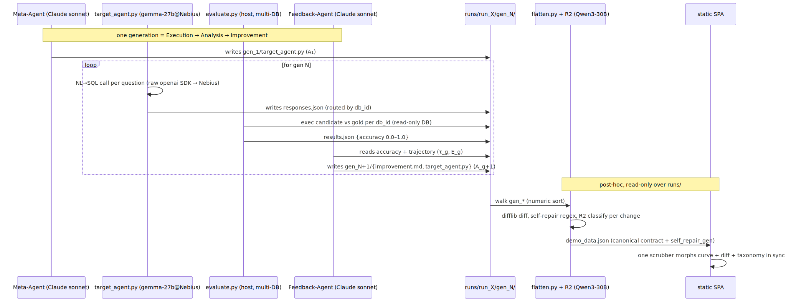

<!-- Developer navigation guide for the hackathon demo system (SIA core + hackathon_demo/ layer).
     Every component name and file path in this document was verified against the codebase on 2026-06-06.
     This is the HACKATHON system's architecture doc. The canonical SIA-core guide is docs/architecture.md
     (project root) — this document does not replace it; reconcile at merge. -->

# Hackathon Demo — System Architecture

A developer-facing guide to the whole system as built: the unchanged **SIA** self-improving framework, the additive **`hackathon_demo/`** layer that turns one SIA run into an educational web demo, and the cost-control routing hedge across **Claude** and **Nebius Token Factory**.

## 1. Overview

| Attribute | Value |
|-----------|-------|
| **System** | SIA-for-SQL demo (self-improving English→SQL agent + replay SPA) |
| **Type** | Research framework (`sia/`) + post-hoc analysis/export tooling + static SPA (`hackathon_demo/`) |
| **Language / Framework** | Python 3.11+ (`sia/`, `hackathon_demo/analyze`, `hackathon_demo/export`); zero-build vanilla JS + CDN libs (`hackathon_demo/web/`) |
| **Architecture pattern** | Pipeline (generation loop) feeding a read-only, file-coupled replay tool — the demo imports nothing from `sia/` |
| **Last verified against code** | 2026-06-06 |

The system runs SIA's harness-update loop (`SIA-H`) on a hard, multi-database **Spider** NL→SQL task. Each generation, a Feedback-Agent rewrites the target agent's code (`A_{g+1} = F(A_g, τ_g, E_g, U)`); accuracy climbs because the *harness* improves while the underlying model stays fixed. After a run completes, `hackathon_demo/export/flatten.py` walks `runs/<run>/gen_*` read-only and emits one `demo_data.json`; a static SPA replays the climb with a synchronized accuracy curve, code diff, and improvement taxonomy.

> [!IMPORTANT]
> **Zero `sia/` edits.** The hackathon layer was built entirely additively. No file under `sia/` was modified. The framework is driven only through its CLI (`sia --task_dir …`) and its on-disk output (`runs/`). This decoupling is the load-bearing architectural property — see [§5 The decoupling seam](#5-the-decoupling-seam).

## 2. Component Architecture (L1)



| Component | Responsibility | Key Files |
|-----------|----------------|-----------|
| SIA orchestrator | Generation loop, per-run venv, agent coordination, CLI entry (`sia`) | `sia/orchestrator.py` |
| Context manager | Per-generation context/state, LLM summaries, metrics extraction | `sia/context_manager.py` |
| Config | Defaults + `SIA_*` env overrides | `sia/config.py` |
| Agent backends | Claude / OpenHands agent execution helpers | `sia/util.py` |
| SQL task | The A2 task: Spider multi-DB task spec, grader, weak seed scaffold | `hackathon_demo/sql_task/` |
| R2 taxonomy | Per-change improvement classifier (LLM + offline keyword fallback) | `hackathon_demo/analyze/` |
| Flatten | The keystone `demo_data.json` builder (the seam) | `hackathon_demo/export/flatten.py` |
| Web SPA | Static, zero-build replay tour | `hackathon_demo/web/` |

## 3. SIA Core (unchanged framework)

The framework implements the paper's harness-update lever (`SIA-H`). For the full concept→module map see [`docs/paper-summary.md` §6](../../docs/paper-summary.md).

The one-generation data flow — through the loop and then the post-hoc demo build — is:



### Generation loop

`sia/orchestrator.py` is both the loop and the CLI entry point (`sia = "sia.orchestrator:main"` in `pyproject.toml`). It coordinates three roles per run:

- **Meta-Agent `M`** synthesizes the first target agent `A₁` into `gen_1/target_agent.py`.
- **Target Agent `A_g`** runs as an isolated OS subprocess (`subprocess.Popen` at `orchestrator.py:568`, no `env=` → parent env inherited), writing its submission.
- **Feedback-Agent `F`** reads the trajectory `τ_g` and metrics `E_g`, then writes the next generation's `improvement.md` + `target_agent.py` (`A_{g+1} = F(A_g, τ_g, E_g, U)`).

Generations accumulate under `runs/run_{id}/gen_{n}/`. The loop length is `--max_gen`.

### Per-run target venv

Each run gets its own virtual environment so the target subprocess has an isolated dependency set. `_create_venv` (`orchestrator.py:400`) prefers **`uv`** (`uv venv` + `uv pip install`) and falls back to stdlib `venv` + `pip`. The installed set is `Config.VENV_PACKAGES` (`config.py:51`): `anthropic`, `openai`, `python-dotenv`, `google-genai`, `tqdm`, `pydantic`, `scikit-learn`, `pandas`, `numpy`.

### Context manager

`sia/context_manager.py` (`ContextManager`, `context_manager.py:50`) tracks per-generation state, extracts metrics from each gen's `results.json`/stdout, generates optional LLM summaries between generations, and finalizes the run record.

### Deterministic verifier

The verifier is the task's own grader, executed on the host (not in the agent). For the SQL task that is `hackathon_demo/sql_task/data/public/evaluate.py` — see [§4](#4-the-sql-task-sql_task). It writes `results.json` with `accuracy` as a fraction `0.0–1.0`.

### Config and backends

`Config.from_env` (`config.py:64`) layers `SIA_*` env overrides onto the defaults: `SIA_META_MODEL`, `SIA_TASK_MODEL`, `SIA_MAX_GENERATIONS`, `SIA_BACKEND`, `SIA_MAX_TURNS`, `SIA_SANDBOX_MODE`. `sia/util.py` provides `run_agent_claude` (`util.py:14`, delegates to `claude_agent_sdk.query` — no api_key argument) and `run_agent_openhands` (`util.py:102`), dispatched by `run_agent` (`util.py:187`).

## 4. The SQL task (`sql_task/`)

The A2 task that the loop self-improves against.

### Benchmark

A **Spider** subset, hard/extra difficulty only: **48 questions across 6 complex databases** (8 per database, 24 `hard` + 24 `extra`). The databases are `car_1`, `concert_singer`, `cre_Doc_Template_Mgt`, `dog_kennels`, `student_transcripts_tracking`, `world_1` — each a sibling `<db_id>.sqlite` under `sql_task/data/public/`. Provenance, per-DB SHA-256, license (CC BY-SA 4.0), and the `held_out` split are recorded in `sql_task/data/private/MANIFEST.json`.

### Multi-DB grader

`sql_task/data/public/evaluate.py` routes each question to its own database by `db_id`, executes the candidate query and the gold query each in a **read-only** connection (`file:<path>?mode=ro`, `uri=True`), and compares result sets as a **sorted multiset** (column order, row order, and within-row cell order all ignored; floats rounded; NULL → sentinel). Any candidate that raises a SQL error scores 0. Accuracy is a fraction `0.0–1.0` (`accuracy_percent` is the convenience percentage).

> [!NOTE]
> Held-out gold SQL lives only in `sql_task/data/private/gold.json`, read solely by `evaluate.py`. The public `sample.json` carries only inputs plus a few EASY `few_shot` demonstrations. This split keeps the benchmark honest — no answer key ships in any public file.

### Deliberately-weak seed scaffold

`sql_task/reference/reference_target_agent.py` is the Gen-1 seed the meta-agent clones. Its weakness is intentional and load-bearing: it prompts the model with only the question and the **bare table names** of that question's database (from `sqlite_master`, read-only) — no schema DDL, no few-shot examples, no retry/self-repair, no error handling. These omissions are precisely the improvements the Feedback-Agent is meant to invent, leaving clear headroom for the curve to climb. The NL→SQL call uses the raw `openai` SDK pointed at Nebius (model id from `SIA_TASK_MODEL`).

## 5. The decoupling seam

The hackathon layer never imports from `sia/`. It couples to the framework in exactly two narrow ways:

1. **CLI in** — the loop is invoked as `sia --task_dir ./hackathon_demo/sql_task …`.
2. **Filesystem out** — `analyze/` and `export/` read only `runs/<run>/gen_*` output, strictly read-only (they never write into `runs/`).

The web layer is decoupled one step further: it reads only `demo_data.json`. `export/flatten.py` is the single bridge that turns run output into that contract — **the keystone seam**.

### `flatten.py` — the `demo_data.json` builder

`hackathon_demo/export/flatten.py` walks `runs/<run>/gen_*` (numeric sort: `gen_10` after `gen_9`) and, per generation, emits: `metrics` (from `results.json`, `None` when absent — the gen_1 off-by-one), the full `target_agent_source`, a `difflib` unified `diff_from_prev`, `diff_highlights` (new-file line numbers of ADDED self-repair lines, regex-flagged), the full `improvement_md`, the R2 `taxonomy` object (reused from `analyze`, never reimplemented), and a templated `process_steps[]` caption track. It also computes an aggregate `headline` carrying the load-bearing **`self_repair_gen`** (the generation that *both* adds SQL self-repair *and* steps up the most in accuracy), plus a templated `tour_steps[]`.

`--run-dir` is configurable, and the default output name is per-run-ready: `demo_data_<run>.json` files let a future experiment selector load multiple runs side by side. The robustness contract is total: any missing per-gen file is tolerated as a `None`/empty field, never a crash.

### R2 taxonomy (`analyze/`)

`analyze/taxonomy.py` is the single source of truth for the **six buckets** in two families:

- **SE-hygiene** (software robustness, not domain insight): `parser-hardening`, `retry/robustness`, `validation`.
- **domain-reasoning** (genuine NL→SQL insight): `new-tool`, `prompt-restructure`.
- Counted separately (reward-hacking smell test): `task-specific-hack`.

`analyze/analyze_improvements.py` classifies each discrete change in every `improvement.md` into a bucket via two paths sharing that bucket set:

- **LLM-primary** — one Nebius structured-output (`json_schema`, `strict`) call per `improvement.md`, model from `R2_CLASSIFIER_MODEL` (falls back to `SIA_TASK_MODEL`).
- **Keyword fallback** — deterministic, offline, network-free; required because the demo is a static replay that must work without a key. A single failed LLM call falls back per-generation; the run never aborts.

### Web SPA (`web/`)

A static, zero-build single-page app: `index.html`, `app.js`, `styles.css`, plus the data file(s). It performs one `fetch` of `demo_data.json` into one `state` and one `render(state)`. It is a **7-screen educational tour** (verified `data-screen` labels): `0` Hook/title, `1` The problem, `2` SIA the approach, `3` Our task, `4` The live improvement, `5` The R2 lens, `6` Result + honest scope.

Screen 4 is the centerpiece: **three synchronized panes** (an ECharts accuracy curve, a diff2html code diff, an ECharts taxonomy stacked bar) driven by one scrubber. The `self_repair_gen` "wow" frame — a GSAP green-pulse over the self-repair diff rows — is keyed entirely off the data (`headline.self_repair_gen` + `diff_highlights[]`), never a hardcoded generation index, so the SPA renders any run correctly. The tour autopilot iterates `tour_steps[]`; grabbing the scrubber pauses it. Also built: a SIA-loop SVG explainer, an honesty card (stated first-class, not fine print), and a model-choice hover ("Why the model is fixed"). `prefers-reduced-motion` and a missing GSAP both collapse cleanly to the static final frame.

CDN libraries (no JS toolchain): **ECharts 6.1.0**, **GSAP 3.15.0** (+ `DrawSVGPlugin`, `MotionPathPlugin`), **diff2html 3.4.56**.

## 6. The Nebius / Claude routing hedge

The system splits LLM work across two providers to control cost and de-risk the hardest agentic job. Verified against `.env.example` and the run recipe:

| Role | Provider | Model | Auth / wire |
|------|----------|-------|-------------|
| Meta + Feedback (the agentic loop) | Claude | `--meta_model sonnet` (default `haiku`) | `--backend claude`; `CLAUDE_CODE_OAUTH_TOKEN` (subscription) or `ANTHROPIC_API_KEY` |
| Target NL→SQL | Nebius Token Factory | `SIA_TASK_MODEL` = `google/gemma-3-27b-it` | raw `openai` SDK against `NEBIUS_API_BASE` |
| R2 classifier | Nebius Token Factory | `R2_CLASSIFIER_MODEL` = `Qwen/Qwen3-30B-A3B-Instruct-2507` | raw `openai` SDK, structured output |

The hedge: Claude carries the hardest LLM job (the Meta/Feedback agentic loop), keeping OSS-agentic risk off the critical path and billing to the user's Claude subscription. The bounded NL→SQL target call and the R2 classifier run on cheap OSS models on Nebius — the honest "ran on Nebius open models" claim.

> [!IMPORTANT]
> The `openai` SDK here is the **Nebius wire protocol**, not an OpenAI provider. No OpenAI endpoint is called; the SDK is pointed at `NEBIUS_API_BASE` (`https://api.tokenfactory.nebius.com/v1/`). Model ids are resolved from the live Nebius catalog at build time, never hardcoded blindly.

The Claude auth path needs **zero `sia/` edits**: `run_agent_claude` passes no api_key and delegates to `claude-agent-sdk`, which honors `CLAUDE_CODE_OAUTH_TOKEN` or `ANTHROPIC_API_KEY`. The SDK spawns the `claude` CLI inheriting the sia process env, so sourcing `.env` covers it. The target subprocess inherits `NEBIUS_*` for free (`Popen` with no `env=`). The seed run uses `--sandbox none` — Docker mode would triple-block Nebius (`--network none`, no env passed, bare image).

## 7. Config and run recipe

All secrets and overrides live in one gitignored root `.env` (template: committed `.env.example`).

```bash
# 1. Install (dev venv with the hackathon extras: R2 classifier + scaffold smoke).
pip install -e ".[dev,claude,demo]"

# 2. Configure: copy the template and fill in the two secrets + the target model id.
cp .env.example .env
#   NEBIUS_API_KEY=...                 (target NL→SQL + R2 classifier)
#   CLAUDE_CODE_OAUTH_TOKEN=...        (Meta + Feedback; `claude setup-token`)
#   SIA_TASK_MODEL=google/gemma-3-27b-it
#   R2_CLASSIFIER_MODEL=Qwen/Qwen3-30B-A3B-Instruct-2507

# 3. Run a generation loop (source .env into the shell first).
set -a && source .env && set +a && \
  .venv/bin/sia --task_dir ./hackathon_demo/sql_task --max_gen 4 --sandbox none

# 4. Flatten the run into the demo contract, then open the static SPA.
python hackathon_demo/export/flatten.py --run-dir runs/run_X --use-llm
#   then serve / open hackathon_demo/web/index.html
```

`--use-llm` selects the Nebius R2 classifier path; omit it for the offline keyword fallback. `flatten.py` writes to `web/demo_data.json` by default (or a per-run `demo_data_<run>.json` via `--out`).

## 8. Where to start

| Goal | Start here |
|------|------------|
| Understand the loop | `sia/orchestrator.py` + [`docs/paper-summary.md` §6](../../docs/paper-summary.md) |
| Change the benchmark | `sql_task/data/public/` (DBs, `sample.json`), `sql_task/data/private/gold.json` + `MANIFEST.json` |
| Tune the grader | `sql_task/data/public/evaluate.py` |
| Change the seed agent | `sql_task/reference/reference_target_agent.py` |
| Change the taxonomy | `analyze/taxonomy.py` (buckets + keywords) |
| Change the demo contract | `hackathon_demo/export/flatten.py` |
| Change the SPA | `hackathon_demo/web/{index.html,app.js,styles.css}` |
| Change routing/models | root `.env` (`SIA_TASK_MODEL`, `R2_CLASSIFIER_MODEL`, `--meta_model`) |
